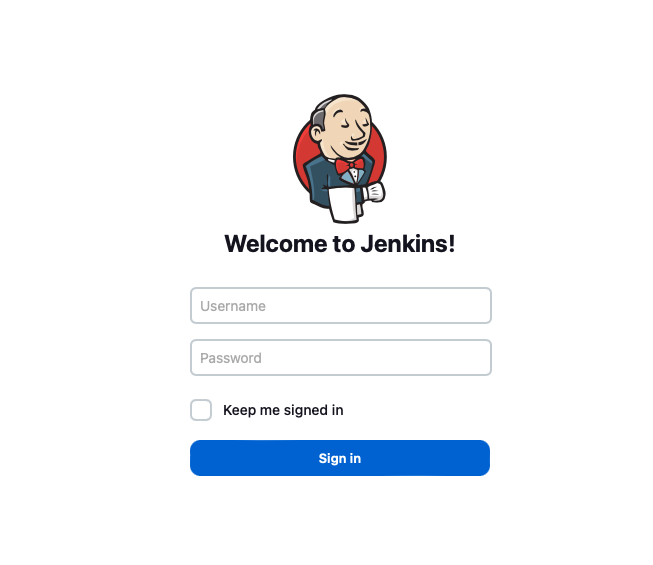
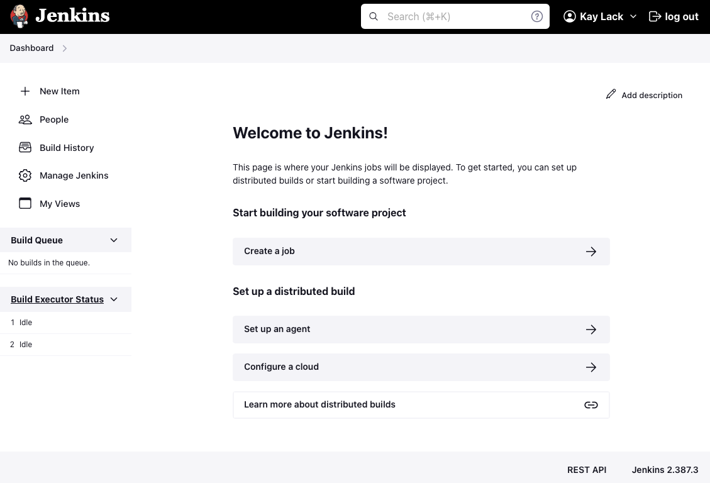

# Set up Jenkins

## Objectives

Learn to:
- Use a fundamental AWS service: EC2
- Use SSH to connect to a virtual machine in the Cloud
- Install software on a virtual machine in the Cloud
- Understand the benefits of hosting developer tools in the Cloud

## Task: Set up the Jenkins Server

EC2 stands for Elastic Compute Cloud. It is a service that provides virtual
machines in the Cloud. You can think of it as a service that provides virtual
computers that you can use for whatever you want.

CloudFormation is a service that allows you to describe the cloud infrastructure
you want using a configuration file which you then upload to AWS. AWS will then
manage the lifecycle of the infrastructure you've created.

Jenkins is a piece of software called an automation server. One of the big
things it automates is Continuous Integration (running tests in the cloud) and
Continuous Deployment (deploying software to the cloud).

Your task is to use the [CloudFormation
template](resources/deploy_ec2_network_v1.json) provided in this repository to
set up some infrastructure on EC2, and then deploy Jenkins onto it.

You will need to add your bucket name to the template before uploading it.

## Key steps

1. Edit the CloudFormation template to use your S3 bucket name.  
   You will need to search the file for the right place to put this.
2. Create a new key pair in EC2. You will need this for the next step.
3. Go to CloudFormation and create a new stack, uploading the configuration file.  
   Select the instance type 't2.micro' and the key pair you created in step one.
4. In the outputs, find the `InstanceDns` record to see the hostname of your
   new server.
5. SSH into your server using the `.pem` key you downloaded in step one. The
   username will be `ec2-user`.
6. Set up Jenkins, according to [the instructions in the official guide to
   Installing and Configuring
   Jenkins](https://www.jenkins.io/doc/tutorials/tutorial-for-installing-jenkins-on-AWS/#installing-and-configuring-jenkins). This will include:
   1. SSHing into your server (you've already done this)
   2. Adding the link to the Jenkins repository to the `yum` package manager.
   3. Installing Java (you're using Amazon Linux 2).
   4. Installing Jenkins.
   5. Starting Jenkins (this can take a few seconds).
   6. Configuring Jenkins with an admin user.
   7. Installing the suggested plugins.
7. **You do not need to configure a cloud or install the EC2 Plugin.**

## Check your work

1. Go to CloudFormation.
2. Click on the stack you created.
3. Click on the 'Outputs' tab.
4. Copy the `InstanceDns` value.
5. The server is running port 8080 using HTTP, so visit something like:  
   `http://YOUR_INSTANCE_DNS_VALUE:8080/`
6. You should see something like this:  

   

7. Log in using your username and password.
8. You should see something like this:  

   

[Next Challenge](03_set_up_pipeline.md)

<!-- BEGIN GENERATED SECTION DO NOT EDIT -->

---

**How was this resource?**  
[😫](https://airtable.com/shrUJ3t7KLMqVRFKR?prefill_Repository=makersacademy%2Fserverless-cicd&prefill_File=02_set_up_jenkins.md&prefill_Sentiment=😫) [😕](https://airtable.com/shrUJ3t7KLMqVRFKR?prefill_Repository=makersacademy%2Fserverless-cicd&prefill_File=02_set_up_jenkins.md&prefill_Sentiment=😕) [😐](https://airtable.com/shrUJ3t7KLMqVRFKR?prefill_Repository=makersacademy%2Fserverless-cicd&prefill_File=02_set_up_jenkins.md&prefill_Sentiment=😐) [🙂](https://airtable.com/shrUJ3t7KLMqVRFKR?prefill_Repository=makersacademy%2Fserverless-cicd&prefill_File=02_set_up_jenkins.md&prefill_Sentiment=🙂) [😀](https://airtable.com/shrUJ3t7KLMqVRFKR?prefill_Repository=makersacademy%2Fserverless-cicd&prefill_File=02_set_up_jenkins.md&prefill_Sentiment=😀)  
Click an emoji to tell us.

<!-- END GENERATED SECTION DO NOT EDIT -->
